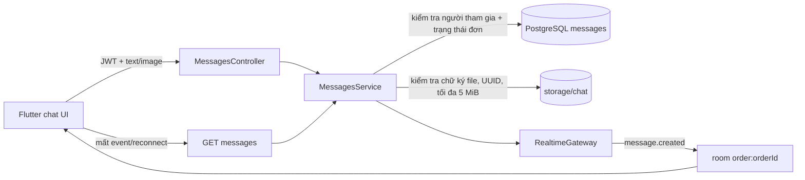

# MotoCare — quy trình chat realtime và ảnh

Cập nhật: 2026-10-05. Chat là một phần của đơn cứu hộ, không phải hộp thư công khai giữa mọi tài khoản.

## Luồng xử lý



Controller chỉ nhận HTTP và trả response. `MessagesService` giữ quy tắc nghiệp vụ/quyền truy cập. `ChatImageStorageService` là ranh giới lưu file; sau này có thể đổi ổ đĩa local sang object storage mà không đổi luồng controller, database hay Socket.IO. `RealtimeGateway` chỉ phát sự kiện, không phải nguồn lưu lịch sử.

## Hợp đồng REST

- `GET /orders/:orderId/messages`: tối đa 100 tin gần nhất theo thứ tự cũ → mới. Khách và thợ được gán của đơn có thể đọc cả sau khi đơn đóng.
- `POST /orders/:orderId/messages`: nhận JSON cho tin chữ hoặc `multipart/form-data` cho chữ, ảnh, hay cả hai. Chỉ gửi được khi đơn ở trạng thái active.
- `GET /orders/:orderId/messages/:messageId/image`: tải ảnh có bảo vệ; cần JWT và phải là người tham gia đúng đơn.

Ảnh chỉ nhận JPEG, PNG, WebP, một ảnh mỗi tin và tối đa 5 MiB. Backend không tin tên file/MIME từ client: kiểm tra chữ ký nhị phân, đổi tên thành UUID và lưu ngoài public web root. Response/event dùng dạng:

```json
{
  "id": 12,
  "senderId": 3,
  "content": "Ảnh vị trí của em",
  "image": {
    "url": "/orders/7/messages/12/image",
    "mimeType": "image/png",
    "sizeBytes": 68
  },
  "createdAt": "2026-10-05T10:00:00.000Z"
}
```

Flutter phải tải `image.url` bằng cùng `Dio` client có Bearer token; không ghép đường dẫn file trên server và không cache công khai. Khi Socket.IO nhận `message.created`, thêm tạm vào UI rồi đồng bộ lại bằng `GET` sau reconnect.

## Lưu trữ và vận hành

- `CHAT_UPLOAD_DIR` mặc định `storage/chat`; thư mục này bị Git bỏ qua và không nằm trong PostgreSQL/Docker volume.
- `CHAT_IMAGE_MAX_BYTES` mặc định/tối đa 5.242.880 byte.
- Khi backup demo cần backup **cả database và thư mục ảnh**. Xóa database không tự xóa file, và xóa thư mục ảnh không tự xóa metadata.
- Bản miễn phí trên laptop chỉ phục vụ khi laptop/API còn chạy. Không có CDN/object storage hoặc cam kết lưu trữ 24/7.

## Ranh giới realtime

- `message.created` phát vào `order:{orderId}` cho cả khách và thợ đang kết nối đúng phòng.
- Socket xác thực JWT và quyền tham gia trước khi join room.
- REST là nguồn dữ liệu chuẩn; Socket chỉ giảm độ trễ. Client luôn gọi lại `GET /orders/:id/messages` sau reconnect vì event có thể bị bỏ lỡ.
