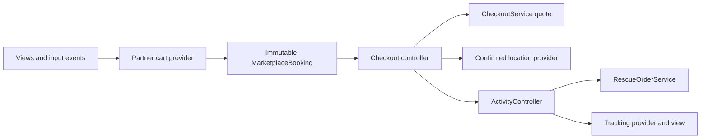

# Feature architecture and refactor boundaries

Moto Care uses a feature-first Flutter layout. The existing module guides in
this directory define product behavior; this document defines how those modules
share data and dependencies. Read it together with `AI_GUIDE.md`, `WORKFLOW.md`
and `DEPENDENCIES.md` before changing application code.

## Reading the existing design

The documentation separates three kinds of state:

- Confirmed session data: Profile, garage vehicles, incident location, Activity
  orders, partner applications and compensation reports.
- Route drafts: cart quantities, Checkout fields, identity-form selections and
  attachments, autocomplete results and the unconfirmed map pin.
- Presentation state: text/scroll controllers, sheet dimensions, focus,
  navigation, map rendering and animation interpolation.

`HOME.md`, `MARKETPLACE.md` and `LOCATION.md` describe the booking data flow.
`ACTIVITY.md` and `ORDER_TRACKING.md` define the shared order and tracking
boundaries. `PROFILE.md`, `VEHICLES_AND_RESCUE_STATIONS.md` and
`SERVICE_SCREENS.md` define account/device operations, discovery and support
features. The remaining guides govern dependencies, contributions, branches,
validation and releases. The more detailed current `LOCATION.md` describes real
Places/GPS support; older descriptions of sample location shortcuts do not
replace that configured integration.

Existing names and compatibility entry points remain: `TrangChu`,
`HoatDongScreen`, `IncidentLocationSearchScreen`, and `IncidentMapPickerScreen`.
Use `snake_case.dart` files, PascalCase model/service/controller/widget names,
and lowerCamelCase fields and providers. New state uses Riverpod `Notifier`
(the installed Riverpod 3 API), without a second state-management library.

## Module layout

| Directory | Responsibility |
| --- | --- |
| `models/` | Typed domain values and immutable state snapshots; no Widget dependencies. |
| `data/` | Explicit sample catalogs and initial data; no sample records in screens. |
| `services/` | Validation, pricing, order construction, device/API operations and simulation. |
| `providers/` | Dependency injection, state transitions, async request lifetime and derived data. |
| `screens/`, `widgets/` | Render provider/model values, forward events, navigate and manage Flutter presentation controllers. |
| `theme/` | Existing colors, text styles and surface styling. |

Small UI descriptors, icon mappings, display labels, layout constants and
animation controllers are presentation concerns. Service-option prices,
identity validation, GPS request revisions, order creation
and simulated checkpoint timers are application concerns and live outside
Widgets. `activity_actions.dart` and `rescue_station_actions.dart` are existing
presentation adapters for dialogs/navigation/feedback; the order service and
controllers do not depend on them.

Domain models may derive totals or other domain values. Some existing
presentation metadata (for example `HomeService` icons and colors) lives in a
model, separate from its rendering Widget. Provider files re-export relocated
public model types where existing callers need compatibility. Models do not
export sample catalogs.

## Booking and location

`CheckoutState` holds the address draft, note, payment preference, errors and
submission/GPS status. `CheckoutService` derives the current quote from the
booking, shop directory and location. The total is the service subtotal plus
travel fee. At submission the controller obtains a fresh quote, confirms the
location, checks the displayed travel fee and creates the shared order. `RescueOrderService` preserves the existing price/JSON fields and
uses an injectable clock for identifiers; `ActivityController` owns session
orders and enforces cancellation/rating/report transitions.

`LocationSearchController` owns the 300 ms debounce, Places session token,
request cancellation/revisions, details, GPS and manual geocoding. It returns a
draft to the view for navigation. `IncidentMapController` owns selected
coordinates, reverse geocoding, camera coordination and final confirmation.
`IncidentCameraController` is a service contract implemented by the native map
adapter. Disposal cancels pending requests. Old responses cannot replace newer
queries, coordinates or typed addresses. Search and map drafts do not update
shared location until the established confirmation point; Checkout retains its
existing GPS-confirmation behavior.

## Chat, tracking and attachments

`ChatService` constructs messages, copies image bytes, supplies the demo reply
and delegates phone launch through the existing injectable launcher. Its clock
is injectable. `ChatMessagesController` owns immutable messages and cancels
pending reply timers when disposed. Sample conversations, support messages,
notifications and quick replies live in `chat/data/` behind providers.

`OrderTrackingController` owns the 1.5-second checkpoint timer and journey step.
The view supplies foreground/chat/reduced-motion/route visibility signals and
retains its Flutter interpolation controller. `OrderTrackingService` derives
status headings, remaining distance and sample ETA. Sample mechanic metadata is
injectable separately. Movement does not change the shared order status.
`trackingChatProvider` holds typed local messages while the parent tracking
route listens; closing the sheet retains them and leaving the route disposes
that conversation. It has no simulated replies.

`attachment_service.dart` helpers supply the gallery/camera boundary, 1600-pixel
capture settings, 5 MB limit and error/required-photo validation.
`AttachmentController` handles picking state and late/disposed results.
`PhotoAttachmentField` renders the preview and forwards selected bytes. Partner
registration retains both identity photos in its route draft; the registration
service validates the required fields and constructs an immutable application.
No identity-photo upload endpoint or disk persistence is introduced.

## Supporting modules and integration

- Partner capabilities, directory filtering, cart quantities and booking
  construction are supplied through feature providers.
- FAQ, price groups, service-place samples and
  policy commitments have explicit injectable data boundaries.
- Completed-order spending summaries, Activity filtering and
  compensation eligibility are derived providers rather than Widget loops.
- Shared search normalization, location validation, auth/password validation and
  profile/HomeUser mapping are reused outside Widgets.

The app remains a session prototype where the feature guides say so. Refactoring
does not turn sample mechanic movement into GPS, sample chat into delivery,
wallet selection into charging, or registration/compensation records into server
submissions. Replace service/data providers with the approved Dio/backend
integration when those endpoints exist. Keep sensitive bytes and credentials out
of logging and persistence.

Theme files, route contracts, dependency versions and native configuration remain
unchanged by this refactor. The current palette includes Home's `#CC0001` brand
red and Chat's existing `#E53935` message accent; both are retained to preserve
the existing white/black/red UI.

## Validation

The existing widget suite covers the route flows, totals, removed reward routes, photos,
draft cancellation, GPS/Places races, lifecycle pauses, retained session data
and 320 px layouts with large text and the keyboard. Independent controller
and service tests additionally exercise those boundaries without a Widget.

Controlled before/after captures compare Checkout, tracking, chat, identity
registration and the rescue request sheet at 390 × 844, with bundled
Roboto fonts, fixed sample records and reduced motion. These compare Flutter
rendering; they do not validate physical-device Google tiles or native dialogs.
Run the repository formatting check, `flutter analyze --no-pub`,
`flutter test --no-pub` and `flutter build apk --debug --no-pub` for changes to
these boundaries.

Refactor verification: the 231 existing tests and 8 new controller/service tests
passed. The six controlled before/after PNG captures were byte-for-byte identical.
