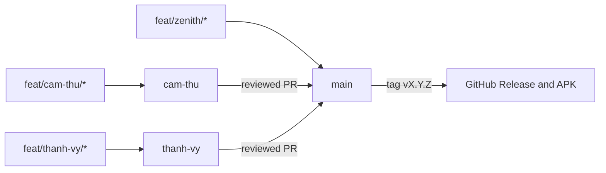

# Workflow, CI/CD, and versioning

This is the authoritative workflow document for every branch. Coding agents must also read the [AI guide](AI_GUIDE.md) and the appropriate guide under [`branches/`](branches/).

## Integration flow

Every arrow is a pull request. Direct commits across these arrows are prohibited.

## Protected branches

The following GitHub rules apply to `main`, `cam-thu`, and `thanh-vy`:

- A pull request and at least one approval are required before merging.
- A review from code owner `@zenith-nguyen` is required.
- `Flutter CI / quality` and `PR Policy / branch-policy` must pass.
- All review conversations must be resolved and history must stay linear.
- Force pushes, protected-branch deletion, and rule bypasses are blocked, including for administrators.

Pull requests into `cam-thu` and `thanh-vy` must use `feat|fix|docs|refactor|test|chore/<owner>/<description>` as the source branch. The repository owner may use `feat|fix|docs|refactor|test|chore/zenith/<description>` directly into `main`; reviewed integration branches and hotfixes may also target `main`. The `PR Policy` workflow enforces this naming rule.

## CI and CD

`Flutter CI` runs for pull requests and updates to the protected branches. It checks Dart formatting, runs `flutter analyze`, runs `flutter test`, and builds a debug Android APK.

`PR Policy` validates source and target branch names for every pull request.

Pushing a tag named `vMAJOR.MINOR.PATCH` runs `Release Android`. The workflow validates the tag against `pubspec.yaml`, runs the application checks again, builds a release APK, and creates a GitHub Release containing that APK.

## Task-branch lifetime

Task branches are not automatically deleted after a pull request is merged. Keep a branch when follow-up work or history review may be useful. Delete it manually only after its author and the repository owner agree that it is no longer needed.

Deleting a merged task branch does not remove the merged commits, but it should still be a deliberate team decision.

## App version

`pubspec.yaml` uses Flutter's `MAJOR.MINOR.PATCH+BUILD` format, for example `1.4.0+37`.

| Change | Version update |
| --- | --- |
| Backward-compatible bug fix | Increase `PATCH`: `1.4.0` to `1.4.1` |
| Backward-compatible feature | Increase `MINOR`: `1.4.1` to `1.5.0` |
| Breaking change | Increase `MAJOR`: `1.5.0` to `2.0.0` |
| Each Android release build | Increase `BUILD` beyond the prior released build |

Only the repository owner changes `version:` for a release prepared on `main`. After the version pull request is merged, create the matching `vMAJOR.MINOR.PATCH` tag.
