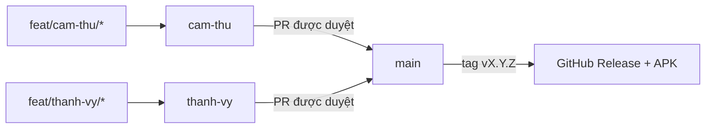

# Quy trình nhánh và kiểm soát phiên bản

## Nhánh tích hợp

`main` luôn đại diện cho bản có thể phát hành. `cam-thu` và `thanh-vy` là hai nhánh tích hợp tách biệt, giúp kiểm tra công việc của từng contributor trước khi ảnh hưởng đến bản ổn định.

Mỗi mũi tên là một Pull Request. Không đẩy commit trực tiếp qua bất kỳ mũi tên nào.

## Branch protection đã áp dụng

Ba nhánh `main`, `cam-thu` và `thanh-vy` cần có các quy tắc sau trên GitHub:

- Bắt buộc Pull Request trước khi merge và tối thiểu một approval.
- Bắt buộc review của code owner `@zenith-nguyen`.
- Bắt buộc các check `Flutter CI / quality` và `PR Policy / branch-policy` thành công.
- Bắt buộc giải quyết toàn bộ conversation, dùng lịch sử tuyến tính và xóa nhánh sau khi merge.
- Chặn force push, xóa nhánh và bypass quy tắc, kể cả quản trị viên.

Chỉ PR vào `cam-thu` hoặc `thanh-vy` mới được dùng nhánh nguồn có dạng `feat|fix|docs|refactor|test|chore/<owner>/<mo-ta>`. PR vào `main` phải xuất phát từ `cam-thu`, `thanh-vy`, hoặc `hotfix/<mo-ta>`. Workflow `PR Policy` kiểm tra quy ước này.

## Phiên bản ứng dụng

Tệp `pubspec.yaml` dùng định dạng Flutter `MAJOR.MINOR.PATCH+BUILD`, ví dụ `1.4.0+37`.

| Khi nào | Cách tăng version |
| --- | --- |
| Sửa lỗi tương thích ngược | tăng `PATCH`: `1.4.0` → `1.4.1` |
| Có chức năng mới tương thích ngược | tăng `MINOR`: `1.4.1` → `1.5.0` |
| Có thay đổi không tương thích | tăng `MAJOR`: `1.5.0` → `2.0.0` |
| Mỗi Android build phát hành | tăng `BUILD` thành số lớn hơn build trước |

Chỉ chủ repository thay đổi `version:` khi chuẩn bị bản phát hành trên `main`. Sau khi PR version đã merge, tạo tag `vMAJOR.MINOR.PATCH`; tag phải khớp ba phần đầu của `pubspec.yaml`.
